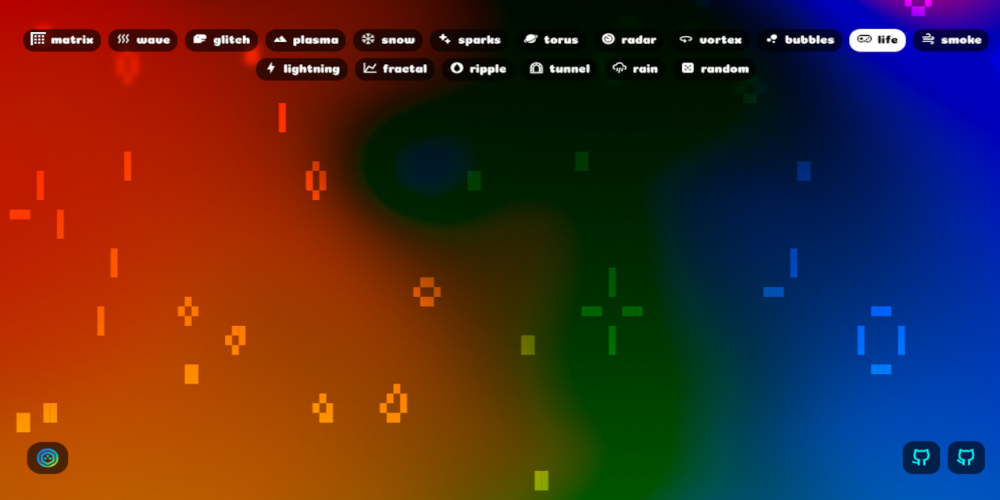

<div align="center">
<h1>

ascii-lab
</h1>
Interactive ASCII art animations
</div>

---

<div align="center">

<a href="https://metaory.github.io/ascii-lab/">
<b>metaory.github.io/ascii-lab</b>
</a>
</div>

---

## Development

```bash
npm run dev
```

## Build

```bash
npm run build
```

## License

[MIT](LICENSE)